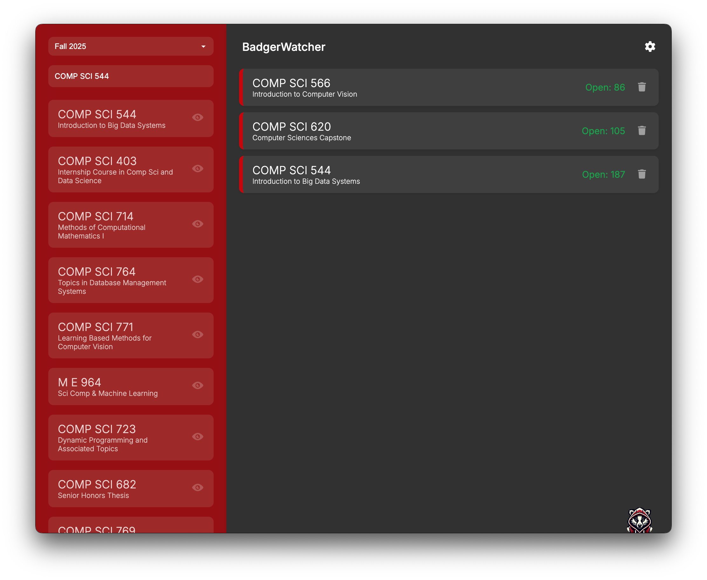

# BadgerWatcher

<p align="center">
  
</p>

An app to watch status for UW-Madison courses. Runs locally with an Electron app making requests to the wisc.edu enrollment API. Desktop notifications are enabled however some setup is required for SMS/iMessage notifications.

## Features

- 🔍 Search for UW-Madison courses 
- 👀 Track multiple courses simultaneously
- 🔔 Real-time notifications when course status changes 
- 📱 SMS/iMessage notifications (when running on macOS only)
- 📊 Historical grade distributions for courses
- 🎓 Professor history and term-by-term grade analysis
- 🎚️ Change terms (Fall, Spring, Summer)
- 💾 Persistent settings and course tracking
- Runs Locally

## Screenshots



## Installation

```bash
# Clone the repository
git clone https://github.com/sooraj-gupta/badgerwatcher.git

# Navigate to the directory
cd badgerwatcher

# Install dependencies
npm install

# Start the application
npm start
```

## How to Use

1. **Launch the app**: Run the app using `npm start`
2. **Select a term**: Choose the academic term you want to track (Fall, Spring, Summer)
3. **Search for courses**: Type course names or numbers in the search bar
4. **Track courses**: Click the eye icon to start watching a course
5. **Monitor status**: The app will show current status (Open, Waitlisted, Closed) with seat counts
6. **View grade history**: Click the chart icon next to any course to view historical grade distributions
7. **Get notifications**: You'll receive desktop notifications when course status changes

## Grade Distribution Feature

View historical course grades to help you make informed decisions:
- See average GPA for any course over time
- Compare instructor grading patterns
- Analyze A-rate percentages across different semesters
- View detailed term-by-term breakdown of grades

## iMessage Notifications (macOS only)

To receive iMessage notifications:
1. Go to Settings (gear icon)
2. Add your phone number
3. Save settings

## Configuration

Settings are saved to app-config.json and include:
- Selected term
- Phone numbers for notifications
- Watched courses

## Requirements

- Node.js
- npm
- Chart.js (automatically installed with npm)
- macOS for iMessage notifications

## Contributing

Contributions are welcome! Please feel free to submit a Pull Request.

## Acknowledgments

- University of Wisconsin-Madison for the public course API
- MadGrades API for historical course grade data

## Disclaimer

This app is not affiliated with, endorsed by, or sponsored by the University of Wisconsin-Madison. Use at your own risk.

---

By: Sooraj Gupta 2025
