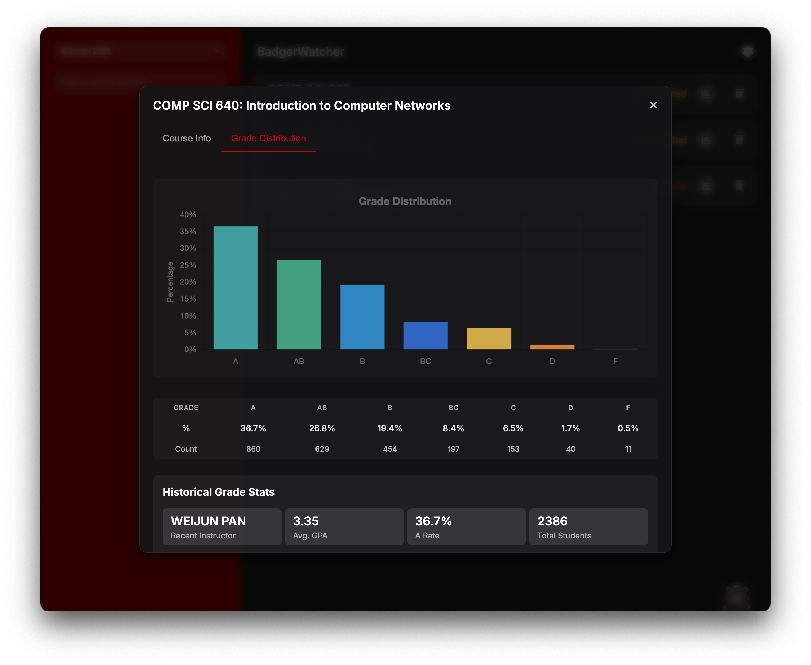

# BadgerWatcher

<p align="center">
  
</p>

A desktop application that monitors and tracks course availability at the University of Wisconsin-Madison. BadgerWatcher provides real-time notifications about course status changes, allowing students to quickly respond to openings in high-demand classes.

## Key Features

- **Real-time Course Monitoring** - Track multiple courses simultaneously with automatic status refreshing
- **Smart Notifications** - Receive desktop alerts and optional iMessage notifications when courses open
- **Course Analytics** - View historical grade distributions and instructor performance metrics
- **Alternative Course Recommendations** - Get suggestions for similar courses when your preferred section is full
- **Textbook Information** - Access required and optional course materials with direct purchase links
- **Enhanced Course Details** - View comprehensive information including prerequisites, learning outcomes, and meeting schedules
- **Term Selection** - Easily switch between different academic terms (Fall, Spring, Summer)
- **Persistent Data** - Settings and watched courses are automatically saved between sessions

## Screenshots

### Main Interface


### Grade Distribution Feature

*View detailed historical grade data for any course*

## Installation

```bash
# Clone the repository
git clone https://github.com/sooraj-gupta/badgerwatcher.git

# Navigate to the directory
cd badgerwatcher

# Install dependencies
npm install

# Start the application
npm start
```

For macOS users who want a standalone app:
```bash
# Package the app for macOS
npm run package
```

## Usage Guide

1. **Launch the app**: Run the app using `npm start` or open the packaged application
2. **Select a term**: Choose the academic term you wish to monitor using the dropdown menu
3. **Search for courses**: Enter course codes or keywords in the search bar (e.g., "COMP SCI 540")
4. **Add to watchlist**: Click the eye icon next to search results to begin monitoring
5. **View details**: Click on any watched course to see comprehensive information including:
   - Current enrollment status and available seats
   - Meeting times and locations
   - Instructor information
   - Prerequisites and course requirements
   - Grade distribution history
   - Required textbooks and materials
   - Similar course alternatives
6. **Receive notifications**: Get alerts when course status changes or seats become available

## Features in Detail

### Course Monitoring
BadgerWatcher checks the UW-Madison enrollment system every few seconds to detect changes in course availability, including:
- Courses changing from closed to open
- Students dropping seats in a course
- New seats being added to a section

### Grade Distribution Analytics
Access historical performance data to make informed course decisions:
- Visualized grade distributions across semesters
- Average GPA and success rates
- Instructor-specific performance metrics
- Term-by-term comparisons

### Textbook Information
BadgerWatcher automatically retrieves and displays course material information:
- Required and optional textbooks
- Direct links to purchase options (UW Bookstore, Amazon, Chegg)
- Additional course materials and resources

### Similar Course Recommendations
When your preferred course is unavailable, BadgerWatcher helps you find alternatives:
- Courses in the same subject area and level
- Real-time availability information
- One-click addition to your watchlist

### Prerequisite Parsing
Complex prerequisite requirements are clearly displayed with visual formatting for:
- Course chains and alternatives
- Cross-listed courses
- Standing requirements (Junior, Senior, etc.)

## Notification Setup (macOS only)

To receive iMessage notifications:
1. Navigate to Settings (gear icon)
2. Add phone numbers to the notification list
3. Click "Save Changes"
4. Test the setup using the "Send Test" button

## Configuration and Data Storage

BadgerWatcher stores its settings in app-config.json, which contains:
- Selected academic term
- Notification phone numbers
- Watched course list
- API keys for external services

## Technologies

- Electron.js - Cross-platform desktop framework
- Node.js - JavaScript runtime
- Chart.js - Data visualization library
- UW-Madison Enrollment API - Course data
- MadGrades API - Historical grade data

## Requirements

- Node.js (v14.0.0 or higher)
- npm (v6.0.0 or higher)
- macOS for iMessage notifications (optional)

## License

This project is licensed under the MIT License - see the LICENSE file for details.

## Acknowledgments

- University of Wisconsin-Madison for the public enrollment API
- MadGrades API for historical course grade data

## Disclaimer

This application is not affiliated with, endorsed by, or sponsored by the University of Wisconsin-Madison. It is an independent tool created to help students monitor course availability. Use at your own discretion.

---

© 2025 Sooraj Gupta | MIT License